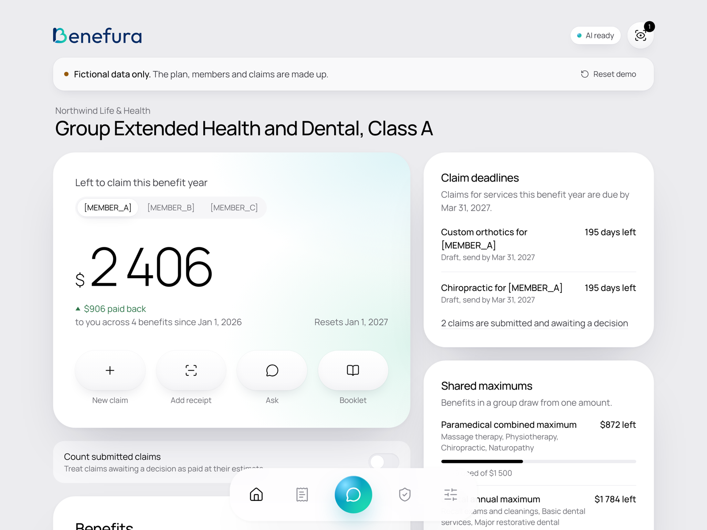
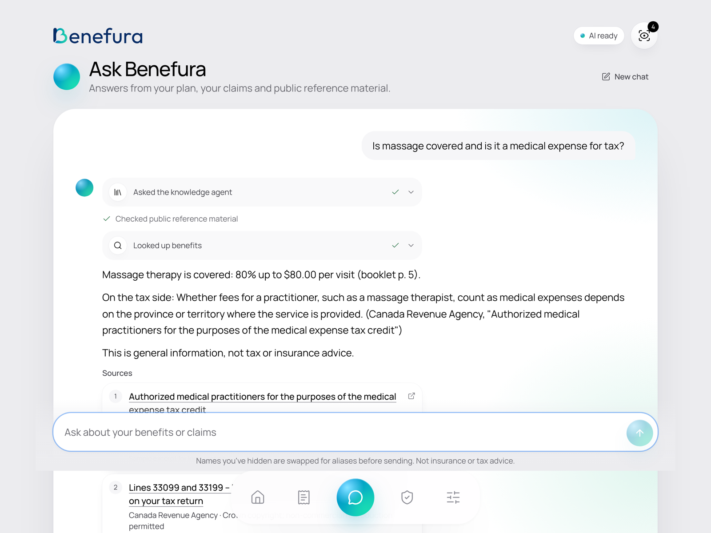
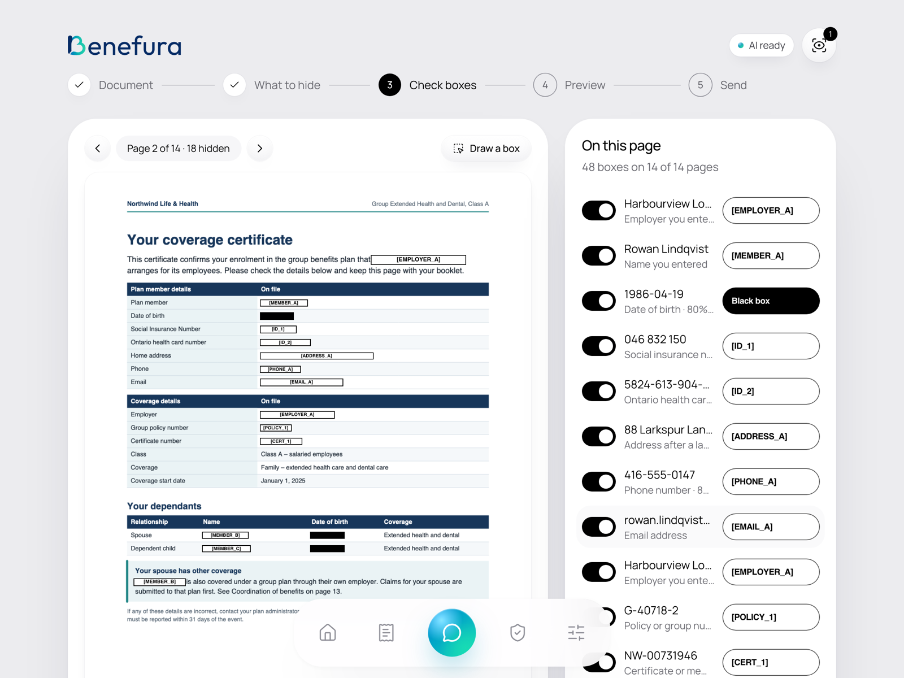
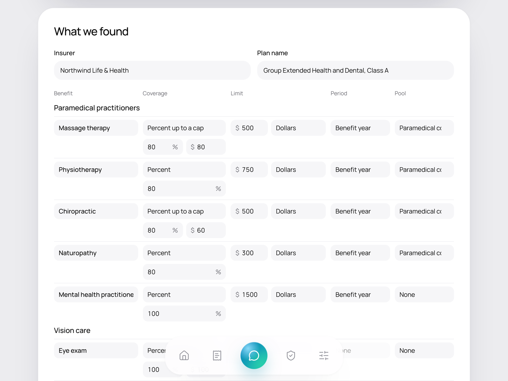
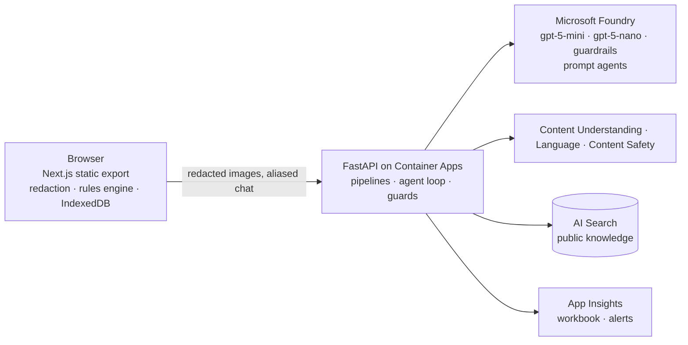

<h1>
  <picture>
    <source media="(prefers-color-scheme: dark)" srcset="apps/web/public/brand/benefura-wordmark-on-dark.svg">
    
  </picture>
</h1>

**See what your health plan still owes you, without handing over your personal information.**

Benefura reads a Canadian extended health booklet or an Australian private health insurance policy,
turns it into a structured plan, and shows what's left to claim for each person, when limits reset
and what a new claim should pay back. A multi-agent assistant on Microsoft Foundry answers questions
about the plan and about public rules such as eligible medical expenses for tax.

Redaction happens in the browser. Only the page images you approve, with personal details painted
over, are ever sent to Azure.

<p>
  
  
</p>
<p>
  
  
</p>

> All plans, people and documents in this repository are fictional. Benefura is not insurance, tax or
> medical advice.

## How it works

1. **Upload a booklet or policy**, or use a fictional sample.
2. **Hide personal details in the browser.** Detectors find names, policy and certificate numbers,
   SIN / health card / Medicare numbers (with checksums), addresses, phones and emails. You review the
   boxes, and each page is re-drawn as an image with the boxes and aliases such as `[MEMBER_A]` burned
   in. You see exactly which images will be sent and acknowledge them.
3. **Extract the plan.** The API runs Content Understanding layout, a Language PII check, Prompt
   Shields, then a Microsoft Agent Framework workflow (triage → extract ⇄ verify) that returns rows
   grounded to page quotes.
4. **Track and claim.** A TypeScript rules engine in the browser computes limits, shared maximums,
   deductibles, frequencies, waiting periods and claim deadlines. Claims, receipts and chat history
   stay in IndexedDB.
5. **Ask the assistant.** A router sends each question to a plan-and-claims agent (tools that run in
   your browser, with approval cards for changes) or a knowledge agent grounded in licensed public
   pages from CRA, Health Canada, Ontario and privatehealth.gov.au.

## Architecture



More detail: [architecture](docs/architecture.md), [privacy](docs/privacy.md),
[threat model](docs/threat-model.md), [transparency note](docs/transparency-note.md) and the
[decision records](docs/adr/README.md).

## Microsoft AI-103 skills

Built to exercise the **Azure AI Apps and Agents Developer Associate (AI-103)** skills outline.
The full map with file references is in [docs/ai-103-skills-map.md](docs/ai-103-skills-map.md).

| Area | In Benefura |
|---|---|
| Foundry services, models and CI/CD | AIServices account and project in Bicep, model deployments, guardrail policy, project connections, azd, OIDC deploy, prompt agents versioned in CI |
| Agents | Two prompt agents with strict tools, a router, agent-as-tool orchestration, browser-executed tools with approvals, stateless `store=false` replay |
| Generative apps and RAG | Extractor ⇄ verifier workflow with grounding, hybrid + vector + semantic search with citations and licences |
| Multimodal and information extraction | Content Understanding layout and a custom receipt analyzer, OCR ingestion, enrichment, push indexing |
| Responsible AI | Jailbreak and indirect-attack guardrails, Prompt Shields, image moderation, two-tier PII policy, evaluations and red teaming |
| Operate | OpenTelemetry to App Insights, a workbook and alerts, per-namespace dollar budgets, rate limits, private networking option |

Not covered by choice: image and video generation, speech and translation.

## Run it locally

No Azure account is needed: `AI_MODE=fake` runs every pipeline with deterministic fakes built from
the sample documents.

Prerequisites: Node 22+, pnpm 10, Python 3.12 via [uv](https://docs.astral.sh/uv/).

```bash
pnpm install

# API (fake AI)
cd apps/api && uv sync
AI_MODE=fake uv run uvicorn app.main:app --reload --port 8000

# Web, in another terminal
cd apps/web && pnpm dev
```

Open http://localhost:3000 and choose **Try the Canadian demo**, or **Read my booklet** with the sample.

## Tests

| Suite | Command |
|---|---|
| API (pytest, ruff, pyright) | `cd apps/api && uv run pytest && uv run ruff check . && uv run pyright` |
| Web (Vitest, types, lint) | `cd apps/web && pnpm test && pnpm typecheck && pnpm lint` |
| End to end (Playwright, fake API) | `cd apps/web && pnpm e2e` |
| Samples, knowledge, evals | `uv run --project <dir> pytest <dir>` |

The end-to-end suite checks the privacy promises directly: uploaded PDFs have no text layer, pixels
under every box are solid, and none of the fictional personal details appear in any request.

## Deploy to Azure

`infra/` provisions everything with azd and Bicep, keyless throughout. See
[infra/README.md](infra/README.md) for the resources, roles, GitHub setup and the telemetry contract,
and [spikes/README.md](spikes/README.md) for the checks to run against a new subscription first.

```bash
azd auth login
azd env set API_IMAGE ghcr.io/<owner>/benefura-api:<tag>
azd up
```

## Repository

| Path | Contents |
|---|---|
| `apps/web` | Next.js app: redaction, rules engine, assistant UI |
| `apps/api` | FastAPI: Azure services, booklet and receipt pipelines, chat agents |
| `samples` | Fictional booklets, receipts, fixtures and golden files |
| `knowledge` | Public-knowledge ingestion into AI Search |
| `evals` | Datasets, harness, Foundry evaluations, red teaming |
| `infra` | Bicep, azd, monitoring workbook and alerts |
| `docs` | Architecture, privacy, threat model, transparency note, ADRs |

## How this was built

I wrote the product plan and made the architecture, privacy and Azure design decisions. The code was
implemented with Claude Code running several agents in parallel (API, browser redaction, rules
engine, chat, infra, samples, evals) against shared contracts, then reviewed, integrated and tested
end to end. The repository was published in milestones, and live Azure verification and deployment
follow in later commits.
