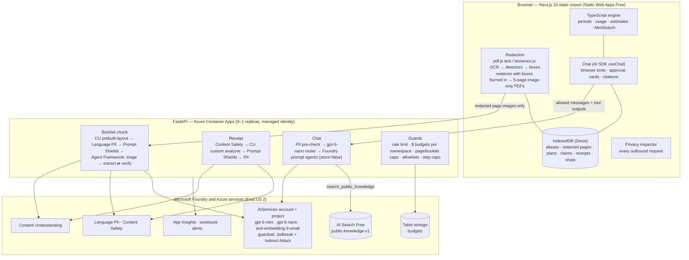

# Architecture

Benefura reads a Canadian extended-health booklet or an Australian private health insurance policy,
turns it into a structured plan, and helps the member track limits, draft claims and ask questions.
The design goal is that **personal information never has to leave the browser**: redaction happens
on the device, and only the redacted images the user approves are sent to Azure.

## Request paths

| Path | What the browser sends | What happens on the server |
|---|---|---|
| `POST /api/plan/analyze-chunk` | A 5-page, image-only PDF of redacted pages (1-page overlap with the next chunk) | CU layout → two-tier PII check → Prompt Shields → Agent Framework workflow (triage, extract, verify ≤2 rounds) → grounded rows with page, quote and confidence |
| `POST /api/plan/assemble` | Extracted rows from every chunk | Deterministic: cents, periods, overlap de-duplication, pool and cost-share linking. No model call |
| `POST /api/receipts/analyze` | One redacted receipt image (≤4 MB) | Image moderation → CU `benefura-receipt` analyzer → Prompt Shields on the OCR text → PII check |
| `POST /api/chat` | Aliased messages, a ≤2 KB context and the active agent | PII pre-check → router → `benefura-plan-claims` or `benefura-knowledge` → UI message stream |
| `GET /healthz` | Nothing | Wakes the scaled-to-zero container, reports AI mode, budget and agent versions |

## Why the pieces are where they are

- **The calculation engine runs in the browser.** Limits, pools, deductibles and estimates are
  deterministic rules over data that is already on the device. The dashboard works with the API
  cold or down, and the assistant's plan tools run locally, so claims history is never sent in bulk.
- **Chat uses registered Foundry prompt agents; extraction uses Agent Framework workflows.** Prompt
  agents are versioned and traced in the Foundry portal. The extraction workflow is server-only and
  needs a verifier loop, which Agent Framework expresses directly. See [ADR 0003](adr/0003-agents-and-workflows.md).
- **Browser tools end the request.** A tool marked `executor: browser` streams its input (and an
  approval request if it changes data) and the browser continues the conversation with the result.
  Server tools (`ask_knowledge_agent`, `search_public_knowledge`) run inside the API loop.
- **Conversation state lives in the browser.** Every Responses API call uses `store=false`; the
  browser replays history with item ids stripped and reasoning items dropped.
- **Knowledge search is a function tool over AI Search.** It guarantees hybrid + vector + semantic
  ranking, works with `store=false`, and returns licence and attribution with every citation.

## Repository map

| Path | Contents |
|---|---|
| `apps/web` | Next.js app: `src/redaction`, `src/domain`, `src/agent`, `src/db`, screens under `src/app` |
| `apps/api` | FastAPI: `app/services` (Azure clients), `app/pipelines`, `app/chat`, `app/agents`, `app/models` (schema source of truth) |
| `knowledge` | Public-knowledge ingestion: fetch → convert → chunk → enrich → embed → push → report |
| `evals` | Datasets, harness, Foundry cloud evaluations, custom evaluators, red teaming |
| `samples` | Fictional booklets, receipts, fixtures and golden files |
| `infra` | azd + Bicep: Foundry, guardrail, Container Apps, Static Web Apps, Search, Storage, monitoring, budget, optional network |
| `spikes` | M0 spike runbook and scripts that verify assumptions against a real subscription |

## Schema flow

`apps/api/app/models/*.py` (Pydantic) → `apps/api/openapi.json` → `apps/web/src/api/schema.d.ts`
(openapi-typescript). CI regenerates both and fails on drift, so the Python pipelines, the browser
engine and the evals share one definition of `Plan`, `Claim` and `Receipt`.
